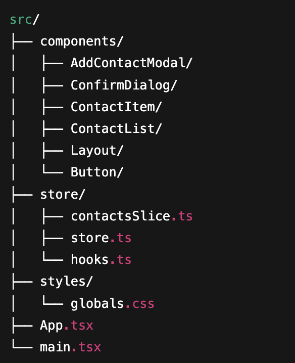
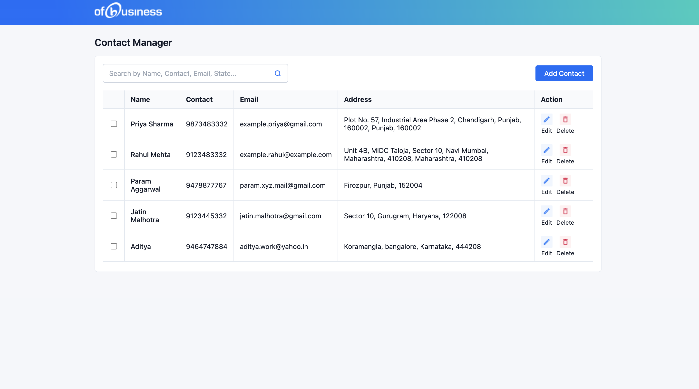
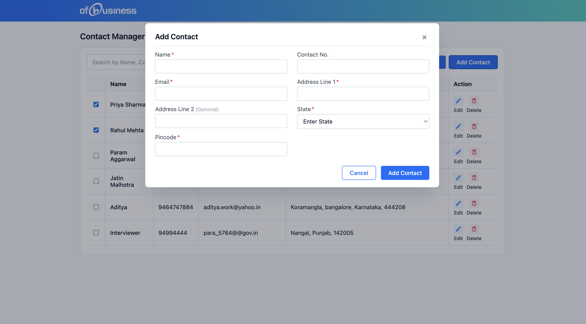
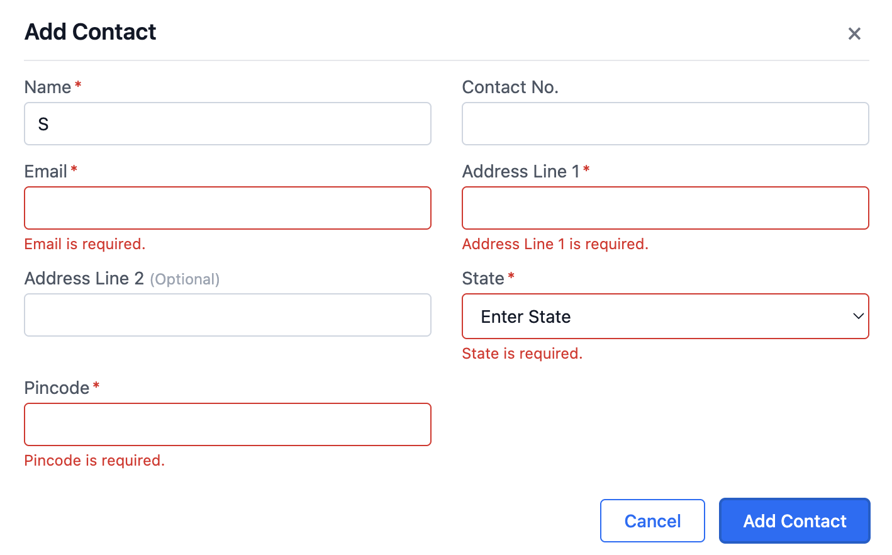
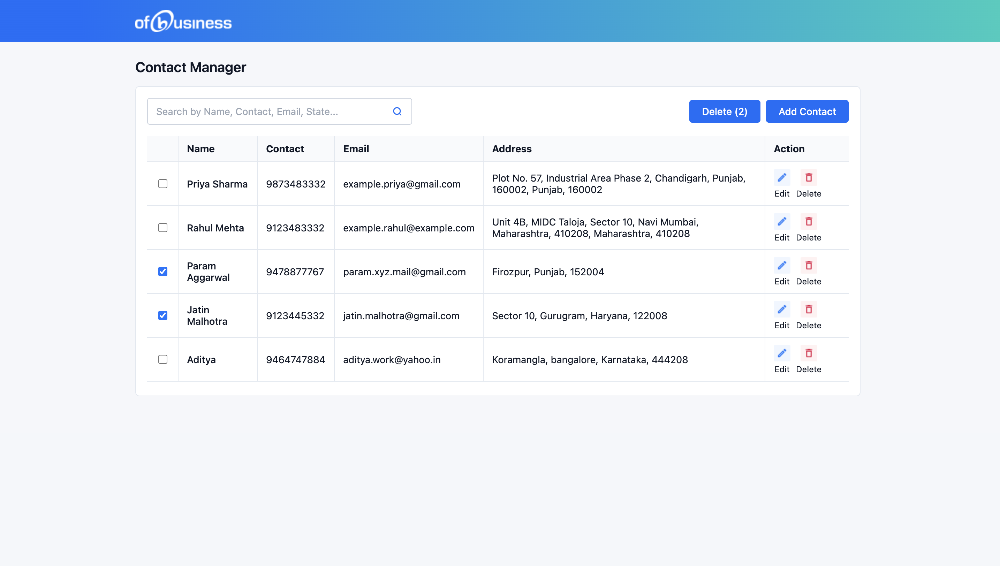
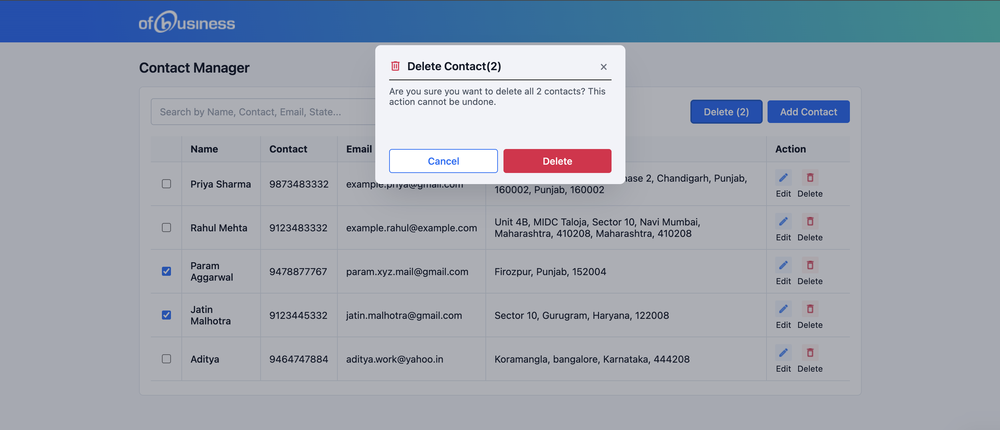
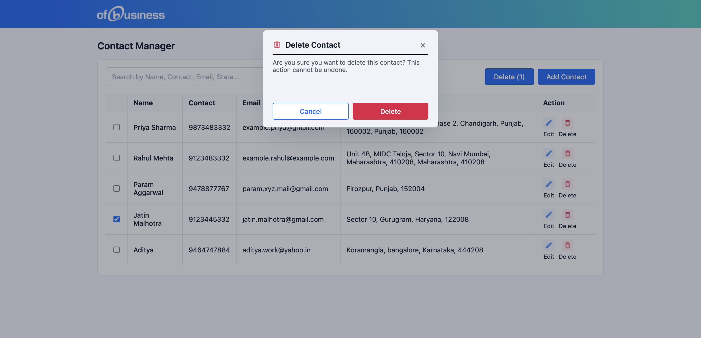
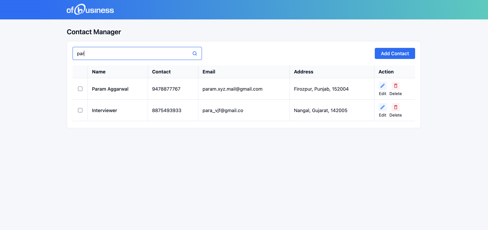
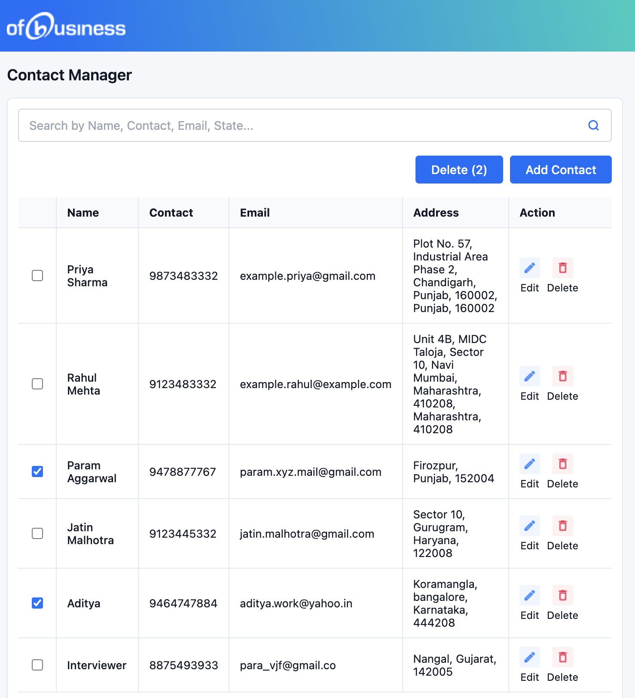

# Contact Manager App (React + Redux)

A feature-rich contact management application built using **React**, **Redux Toolkit**, and **CSS Modules**, designed to closely match Figma UI specifications.

---

## Features
- Add contacts with validation
- Edit contacts (Name field locked for integrity)
- Bulk delete with confirmation modal
- Search by name, email, state, or contact number
- Fully responsive layout
- Pixel-perfect Figma styling

---

## Tech Stack
- **React 18 (Vite)**
- **Redux Toolkit + React-Redux**
- **CSS Modules**
- **TypeScript**
- **Vite**

---

## Installation & Running Locally
cd contact-manager-app
npm install
npm run dev
---

## Project Structure

---

##  Assumptions & Constraints
- Contact number: **max 10 digits**
- Pincode: **6 digits**
- Name field is **read-only** during edit
- Required fields: Name, Email, Address Line 1, Pincode, State

---

## UI Screenshots

### Homepage  

### Add Contact Modal  

### Add Contact Form Validation  

### Batch Select Contacts  

### Batch Delete Confirmation  

### Delete Confirmation (Single)  

### Search Results  

### Responsive Layout View  
